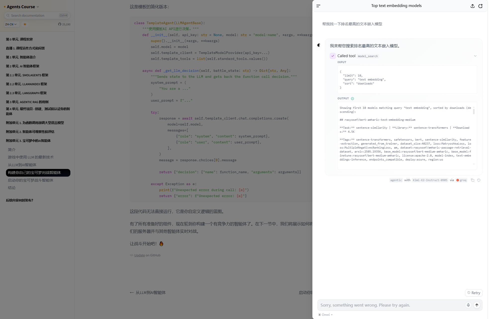
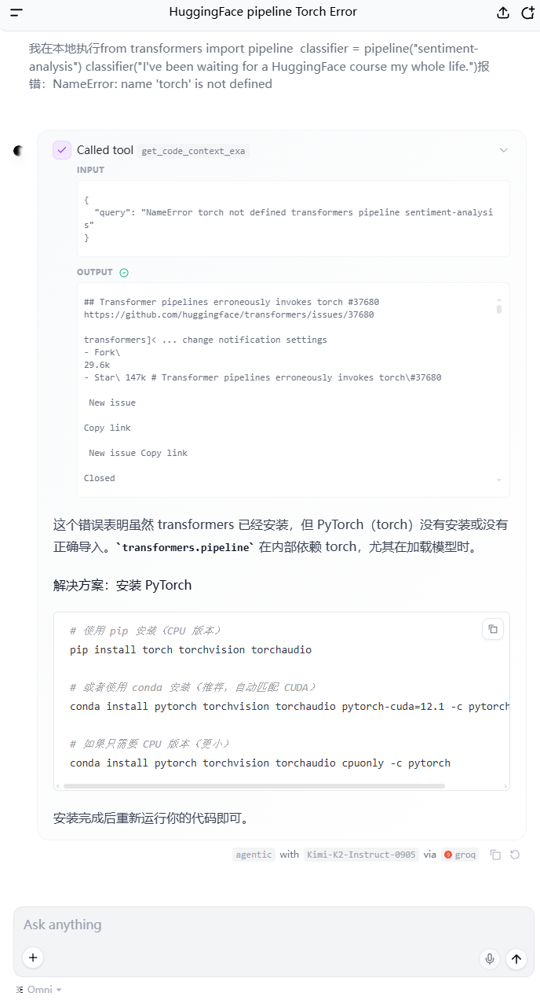

# MVP版本个人助手（带Agent逻辑展示）需求文档与技术架构文档

## 一、MVP版本需求文档（核心基础功能）

### 1. 文档概述

本文档明确个人助手MVP版本（类似HuggingChat带Agent逻辑展示）的核心需求、范围、用户场景，聚焦"基础聊天+Agent工具调用+逻辑可视化"三大核心，不涉及复杂扩展功能，确保快速落地、流程闭环。

**参考示例：HuggingFace Chat界面**

### 2. 核心需求（MVP必做）

#### 2.1 前端交互需求

- 聊天窗口：支持用户输入提问、展示用户/助手对话历史，支持简单换行、清空对话功能。
- Agent逻辑展示：在聊天窗口实时展示Agent的思考步骤、工具调用详情（工具名称、入参、返回结果），无需复杂格式化，清晰可读即可，最终回答在最后展示。
- 基础反馈：加载动画（提问后等待响应时）、简单错误提示（如网络异常、工具调用失败）。
- 适配性：支持PC端基础适配（无需响应式，聚焦桌面端使用场景）。
- 实时交互：采用stream（流式）模式与Agent交互，实现思考步骤、工具调用、最终回答的逐步渲染，避免用户长时间等待完整响应，提升体验（贴合实时展示需求）。

#### 2.2 核心功能需求

- 基础聊天：助手可基于用户提问，返回自然语言回答（无需复杂多轮记忆，仅保留当前会话简单上下文，但不同会话之间不共享上下文）。
- Agent工具调用：集成1-2个简单工具（如基础搜索、计算器），Agent可根据用户提问，自主判断是否调用工具、调用哪个工具，完成后结合工具结果生成回答。
- 逻辑可视化：全程展示Agent的核心逻辑（思考步骤："用户需要查天气，调用天气搜索工具"；工具调用：工具名称、入参；工具返回：原始结果；最终回答推导）。
- 会话管理：支持单次会话（关闭页面后会话清空，暂时无需持久化存储）。

#### 2.3 用户场景

用户在PC端打开页面，输入提问（如"计算订单号123456的订单金额的9折是多少"），助手通过Agent判断是否调用工具，调用过程及思考逻辑实时展示在聊天窗口中，最终返回准确回答，用户可查看Agent的决策和工具调用细节。

## 二、MVP版本技术架构文档

### 1. 架构概述

整体采用"前端-后端-Agent引擎-工具层"四层架构，基于Vue3（前端）、Python+FastAPI（后端）、LangChain/LangGraph（≥1.0，Agent引擎）搭建，聚焦MVP核心功能，架构简洁、可扩展，确保各层解耦、开发高效，实现"用户提问→Agent决策→工具调用→逻辑展示→回答反馈"的完整流程。

### 2. 技术栈选型（明确指定）

| 架构层 | 核心技术栈 | 辅助工具/依赖 |
|--------|-----------|--------------|
| 前端层 | Vue3 + TypeScript + Pinia（状态管理） | Axios（接口请求）、Element Plus（基础组件，如输入框、加载动画） |
| 后端层 | Python + FastAPI | Uvicorn（运行服务器）、Pydantic（数据校验） |
| Agent引擎层 | LangChain/LangGraph（≥1.0） | OpenAI API（通过.env变量配置base_url、api_key和model_name） |
| 工具层 | 自定义简单工具 | 订单搜索（自定义业务搜索工具，传参为订单号，返回订单信息）、简单计算函数（计算器工具） |

### 3. 各层核心职责与实现逻辑

#### 3.1 前端层（Vue3）

**核心职责**

负责用户交互、数据展示，与后端进行接口通信，实时渲染对话和Agent逻辑面板。

**核心实现**

- 页面布局：悬浮一个聊天按钮，点击后展开右侧聊天模态框窗口，采用Element Plus的布局组件快速搭建。
- 状态管理：用Pinia管理会话状态（对话历史、当前输入内容、加载状态、Agent逻辑数据）。
- 接口请求：用Axios调用后端FastAPI接口，支持POST请求（提问）、接收结构化响应（回答+Agent逻辑），实时返回数据并渲染到聊天窗口中。
- 可视化渲染：聊天窗口根据后端返回的Agent逻辑数据（思考步骤、工具调用、返回结果），按顺序渲染，无需复杂样式，清晰区分各环节即可。

#### 3.2 后端层（Python+FastAPI）

**核心职责**

提供前端交互接口、管理会话上下文、调度Agent引擎、转发工具调用请求与结果，实现前后端数据解耦。

**核心实现**

- 接口设计：提供1个核心接口（POST /chat），接收前端传入的用户提问、当前会话上下文（简单历史），实时返回结构化响应（包含助手回答、Agent逻辑明细）。
- 会话管理：MVP版本无需持久化，仅在内存中维护单次会话的上下文（用户提问+历史回答），供Agent引擎参考。
- Agent调度：接收前端请求后，将提问和上下文传入LangChain/LangGraph Agent引擎，获取Agent的思考过程、工具调用结果、最终回答，封装成结构化数据，返回给前端。
- 数据校验：用Pydantic定义请求体（用户提问）和响应体（回答+Agent逻辑），确保数据格式正确，减少异常。

#### 3.3 Agent引擎层（LangChain/LangGraph ≥1.0）

**核心职责**

Agent的核心决策层，负责接收后端传入的用户提问，判断是否需要调用工具、调用哪个工具，执行工具调用，结合工具结果生成最终回答，并记录整个逻辑过程（供前端展示）。

**核心实现**

- LLM集成：通过LangChain调用第三方LLM API（兼容OpenAI的方式），作为Agent的思考核心。
- Agent搭建：用LangGraph（≥1.0）搭建简单的Agent工作流，定义节点（思考节点、工具调用节点、回答生成节点），实现"思考→工具调用（可选）→回答"的流程闭环。
- 工具注册：在LangChain中实现2个简单工具（订单搜索（自定义业务搜索工具，传参为订单号，返回订单信息）、简单计算函数（计算器工具）），定义工具的名称、入参、功能描述，供Agent判断调用。
- 逻辑记录：记录Agent的每一步操作（思考步骤："用户需要计算，调用计算器工具"；工具调用：工具名称、入参；工具返回：原始结果），传入后端，最终转发给前端展示。
- 有良好可读性的日志输出

#### 3.4 工具层（可插拔）

**核心职责**

提供Agent可调用的具体能力，接收Agent的调用请求（入参），执行具体操作，返回结果给Agent引擎。

**核心实现（MVP版本）**

- 订单搜索工具：先mock实现，根据订单号返回固定的订单信息。
- 计算器工具：自定义简单Python函数，接收数字和运算符号（入参），执行计算，返回结果。
- 工具规范：遵循LangChain的工具定义规范，确保Agent能正确解析工具的入参、调用工具、接收结果，实现工具可插拔（后续可扩展更多工具）。

### 4. 核心流程闭环（MVP版本）

1. 用户在前端Vue3页面输入提问，点击发送，前端通过Axios调用后端FastAPI的/chat/stream流式接口，传入提问和简单会话上下文。
2. 后端FastAPI接收请求，校验数据后，将提问和上下文传入LangChain/LangGraph Agent引擎，开启流式交互模式。
3. Agent引擎通过LLM（流式输出）判断是否需要调用工具：如需调用，实时执行工具调用（获取工具返回结果）；如无需调用，直接生成回答片段；全程逐段记录思考步骤、工具调用详情，实时返回给后端。
4. 后端接收Agent返回的流式片段（思考、工具调用、回答），逐段封装成结构化数据，通过StreamingResponse实时返回给前端。
5. 前端接收流式响应片段，实时渲染聊天窗口，逐步完善内容。
6. Agent引擎完成全部逻辑推导和回答生成，后端结束流式响应，前端渲染完整的对话和Agent逻辑，完成一次实时交互。

